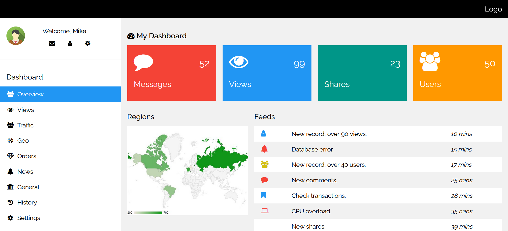
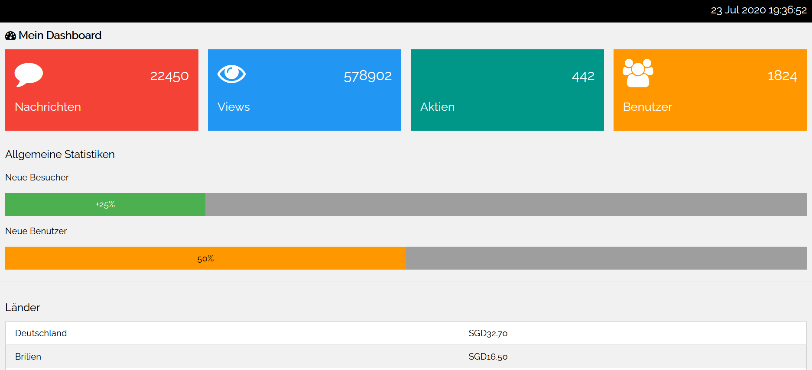

⚠️ This repo is no longer maintained! Please visit https://github.com/PhraseApp-Blog/ for the up-to-date repo.

# How to Internationalize and Localize Your Flask Application
This tutorial will show you how do internationalization and localization in your Flask application. We are going to make full use of the locale, glob and json modules in creating a multilingual analytic dashboard.

# Setup
For your information, this tutorial is based on Python3. We are going to use the following modules in our project.
* flask
* locale
* datetime
* glob
* json

Run the following command in your terminal.

    pip install flask

# Language Files
Language files will be stored as nested JSON data format.

```js
{
  "last_updated": "Zuletzt aktualisiert am",
  "dashboard_title": "Mein Dashboard",
  "message": "Nachrichten",
  "view": "Views",
  "share": "Aktien",
  "user": "Benutzer",
  "general_stat": "Allgemeine Statistiken",
  "new_visitor": "Neue Besucher",
  "new_user": "Neue Benutzer",
  "country": "Länder",
  "country_list": {"germany": "Deutschland", "united_kingdom": "Britien", "russia": "Russland", "spain": "Spanien", "india": "Indien", "france": "Frankreich"}
}
```

# index.html
To keep things simple, this tutorial will use a modified version of [analytic dashboard HTML template made by W3.CSS](https://www.w3schools.com/w3css/tryw3css_templates_analytics.htm)



# mydashboard.py
Complete code for Flask server

```python
from flask import Flask, render_template
import locale
import datetime
import glob
import json

app = Flask(__name__)

def get_stats(input):
    return locale.format_string('%d', input)

def get_currencies(input):
    return locale.currency(input, international=True)

def fetch_data():
    global stats
    global currencies
    global last_updated_time

    stat = {"message": 22450, "view": 578902, "share": 442, "user": 1824}
    currency = {"germany": 32.7, "united_kingdom": 16.5, "russia": 14.3, "spain": 10.8, "india": 7.6, "france": 4.9}

    stats = {k: get_stats(v) for k, v in stat.items()}
    currencies = {k: get_currencies(v) for k, v in currency.items()}

    last_updated_time = datetime.datetime.now().strftime(date_format)


@app.route('/dashboard/<language>')
def dashboard(language):
    if(language not in languages):
        language = app_language

    return render_template('index.html', **languages[language], stats = stats, currencies = currencies, update_time = last_updated_time)

if __name__ == '__main__':
    app_language = 'en_SG'
    locale.setlocale(locale.LC_ALL, app_language)

    languages = {}
    stats = {}
    currencies = {}
    date_format = "%d %b %Y %H:%M:%S %Z"
    last_updated_time = ""

    language_list = glob.glob("language/*.json")
    for lang in language_list:
        filename = lang.split('\\')
        lang_code = filename[1].split('.')[0]

        with open(lang, 'r', encoding='utf8') as file:
            languages[lang_code] = json.loads(file.read())

    fetch_data()
    app.run('0.0.0.0', port=5000)

```

# Running Flask server

    python mydashboard.py

# Loading the web app in your browser
Webpage for English/Singapore (default).

    http://localhost:5000/dashboard/en_SG


For German internationalization, go to the following url

    http://localhost:5000/dashboard/de_DE


